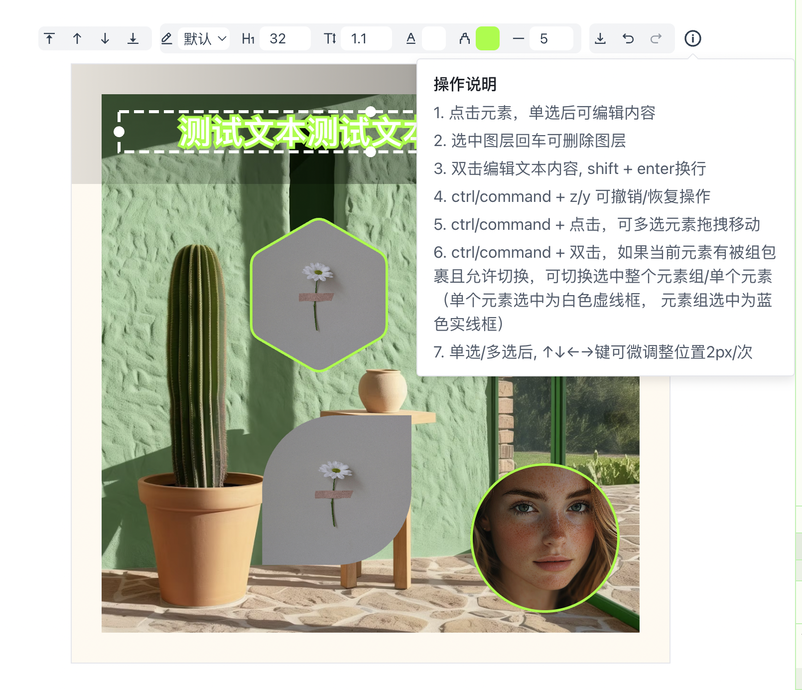
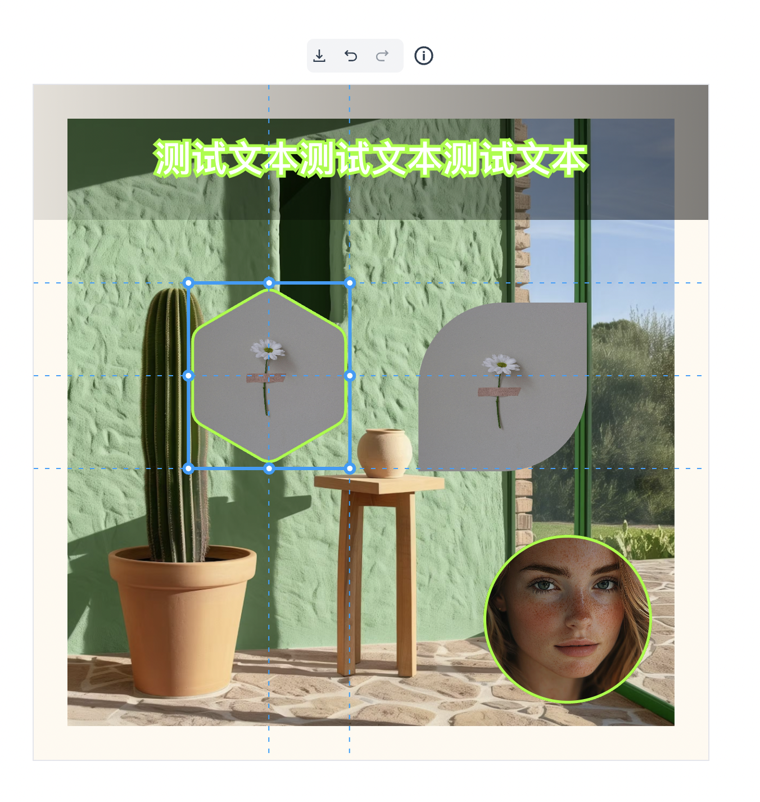

# konva-editor

konvajs 图文编辑器

### 使用

```vue
    <konva-editor 
        :show-operate-area="exampleData.operateArea"
        :size="exampleData.size"
        :data="exampleData.layers">
    </konva-editor>
```

### 效果





### 图层数据结构

[json](./src/components/konva-editor/data.ts)
